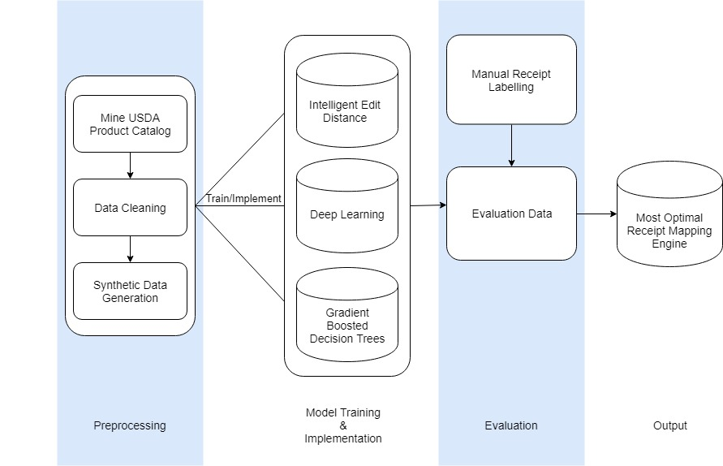

# Introduction

Over 100 million Americans are currently diagnosed with diabetes or prediabetes and this number is only expected to grow in the near future. Diabetes is often associated with a plethora of negative effects, including drastic unwanted changes in lifestyle, negative body image, and poor mental health. While lifestyle changes decrease the chance of a prediabetic patient becoming diabetic by 17%, the current standard practices for helping prediabetic patients make this jump (a brochure, food journaling, etc.) are either impersonal, distant, or time-consuming. Our client Gavin Max, experienced businessman and entrepreneur, has conducted extensive market research and inquiry to create the Personal Virtual Inventory (PVI) project, the future tool for aiding prediabetic individuals in making healthy dietary decisions.

The Personal Virtual Inventory Project will help millions of diabetic and prediabetic individuals take control of their health by keeping track of their food purchases and formulating meal plans that adhere to dietary restrictions recommended by doctors. The idea of the project is to read in electronic receipts and automatically populate an inventory for a user, which they can use to keep track of their physical food inventory with minimal manual input. The system will use this inventory to generate recipes that follow any medical-necessary diets to support a healthy lifestyle. Due to the complex nature of this project, our team is specifically focusing on creating an API that can accept an electronic receipt and return pertinent information from the receipt, including the grocery store, the total cost of the purchase, and a description of each item that was purchased. We will focus solely on electronic receipts received via email that grocery stores like Publix and Walmart currently support; these emails often use HTML to format the receipt within the email.

## Pipeline

The following displays the general pipeline of the project. For more information about this project and the pipeline process, review the accompanying documentation. 


# Getting Started

This project requires [python 2.7](https://www.python.org/downloads/release/python-2713/). Please install [python 2.7](https://www.python.org/downloads/release/python-2713/) for the designated operating system you are using. If asked about putting python in your PATH, say yes. 

This project also requires installing [postman](https://www.getpostman.com/downloads/). Please install postman [here](https://www.getpostman.com/downloads/).

Next, open a terminal or command prompt. Navigate to the root directory of the project. To install all the libraries and dependencies required for the project, follow the command:
```
$ sudo pip install --upgrade pip
$ pip install --upgrade -r requirements.txt
```

You are set!


# Navigation

This project is organized by the different high level folders, each high level folder has a more detailed README as well to help describe necessary steps for set up, explain the file structure, content, and dependencies: 

#### /api
This section contains the code necessary to run the web service (API) that can receive an HTML receipt as input and return the JSON-formatted parsing of the receipt.
#### /approaches
This section contains the code written to test and train the three different approaches used to try to understand receipts.
#### /synthetic data 
This section contains the code written to process the USDA branded product database by cleaning it and generating synthetic data that can be used for the different approaches.
