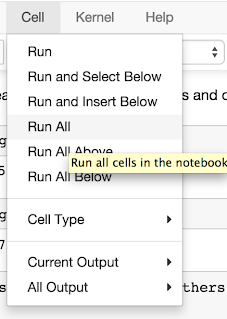

# Disclaimer

Currently, all of the approaches have been trained on synthetic data that was generated by rules we believed were indicative of the real world receipt mappings. All models will need to be further tuned with real world data once it has been attained.

# LSTM Approach

All files for the LSTM approach are located in `/approaches/LSTM/`. This approach to understand receipt mappings involves the use of an LSTM (Long Short-Term Memory) model. **Note:** Please look at the supporting document for why we chose this algorithm and how this algorithm works fundamentally. Currently, there are too many classifications for this classifier to be trained on. The current model has not been tested yet, but has 90% train accuracy on 50k labels. LSTM_generator.ipynb was an attempt to train on all of our data by training on the fly with a generator but is still being tested and is not functional. 

## Running

Open a terminal or command prompt. Navigate to the root directoy. Type:
```
$ jupyter notebook
```
Navigate to:
```
/approaches/LSTM/
```
Run LSTM.ipynb for the current LSTM implementation. Please note, this notebook is only for retraining a model. It will take a while to run until completion. The output of this .ipynb will be the saved models. These will be located in `/approaches/LSTM/models`. These models will be evaluated for performance before being used in the API endpoint. Below is an image on how to run the .ipynb file.  





# Edit Distance

Edit Distance, or Levenshtein Distance, measures the similarity between two strings by counting the number of operations needed to transform one string into the other. In our case, we are going from the abbreviated receipt title to the full product title. We implemented Weighted Edit Distance, a variation on Edit Distance, that weights Add operations more lightly than Remove and Substitute operations, which leads to better results since we expect the full product title to be longer than the abbreviated title. Additionally, we implemented Alphabetized Optimization, in which we only perform Edit Distance calculations with products in buckets corresponding with the first letter of each word in the abbreviated title, in order to speed up calculations without sacrificing accuracy.  


## Running

Navigate to api directory. Type:
```
$ python3 receipt_reader.py
```
Open Postman.
Make a GET request for 127.00.1:5000/get-receipt-info.
Navigate to the Body tab and paste the body of api/test_files/publix_receipt.html here.
Click Send and wait for the results to appear!

# Gradient Boosted Decision Trees

This approach to understand receipt mappings involes the use of Gradient Boosted Decision Trees. Please see supporting documents for our underlying decision to use this algorithm and how it fundamentally works. 

## Running

Open a terminal or command prompt. Navigate to the root directoy. Type:
```
$ jupyter notebook
```
Navigate to:
```
/approaches/gbdt/
```
First, run `feature_engineering.ipynb` which will generated a .csv file called `featured_df.csv`. `featured_df.csv` is essentially a table of all of the features we are currently using to train a model. This file is required for model_training.ipynb. Our current features that we have implemented include:
* num_vowels - number of vowels present in the receipt title
* num_words - number of words present in the receipt title
* num_chars - number of characters present in the receipt title
* num_digits - number of digits present in the receipt title
* num_symbols - number of symbols (EX: $.,"") present in the receipt title
* num_letters - frequency of each letter present in the receipt title
* is_plural - is the receipt title plural
* has_char_repeat - are there repeated characters (EX: a**pp**les, ch**ee**se, etc)
* has_color - is color present in the receipt title
* has_brand - is brand present in the receipt title (brands computed in `/synthetic_data/data/brands.json`)
* has_descriptor - are descriptors present in the receipt title (descriptors computed in `/synthetic_data/data/descriptors.json`)
* has_unit - are units present in the receipt title (EX: lb, pk, oz)

Next, run `model_training.ipynb` to train a Gradient Boosted Decision Trees model. Currently, training time is incredibly long due to the number of features we are employing. In the future, feature reduction strategies need to be used (like PCA) and more analysis on the features will need to be done. This is all highly dependent on data and whether real world data can be obtained. 

`xgboost.ipynb` is an implementation of Gradient Boosted Decision Trees using the XGBoost library. It is currently not fully working. Please resort to `model_training.ipynb` to train a proper GBDT model. 